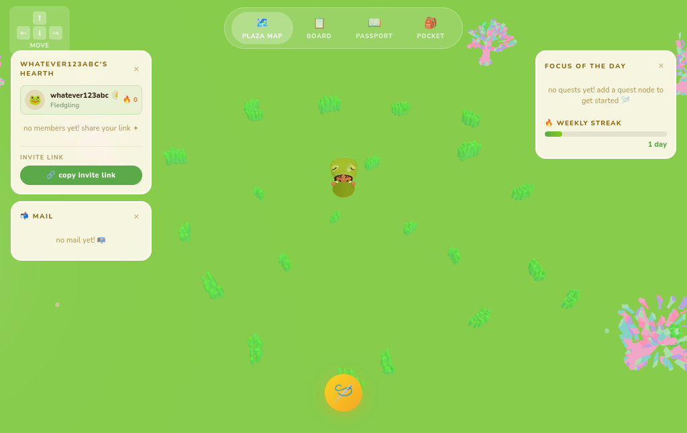
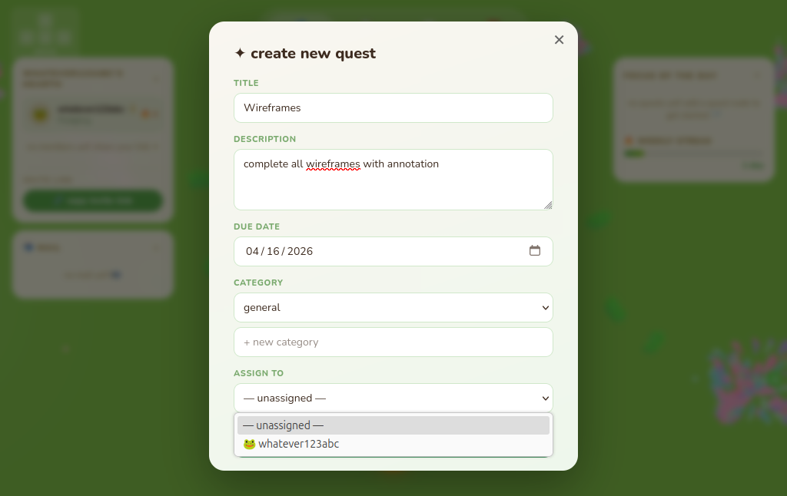
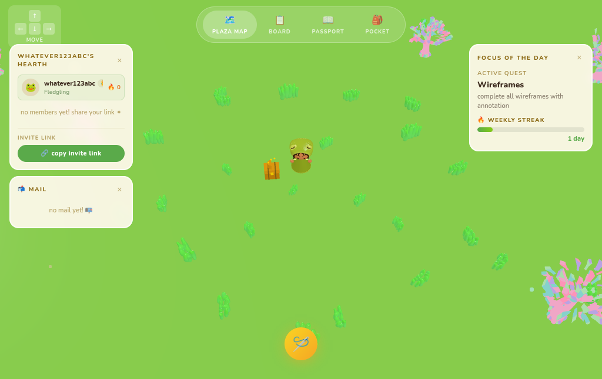
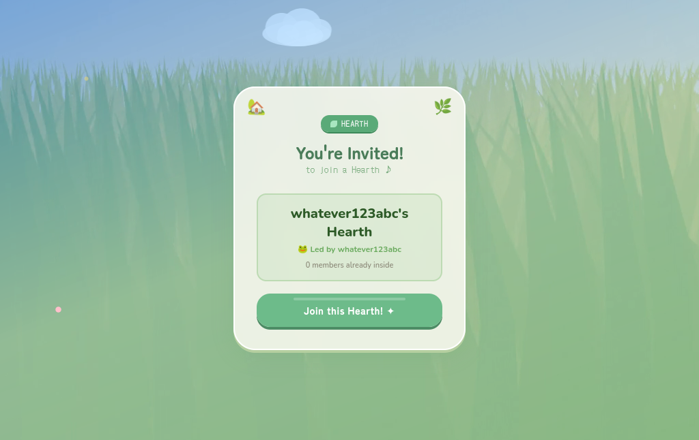
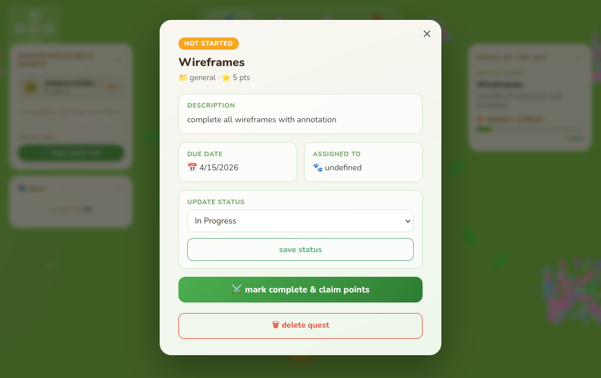
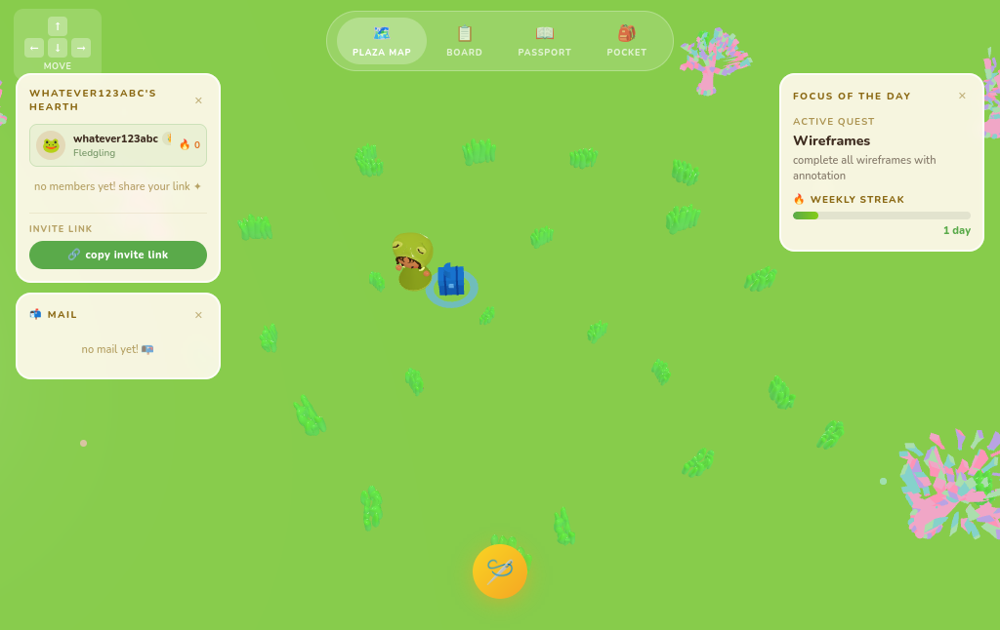
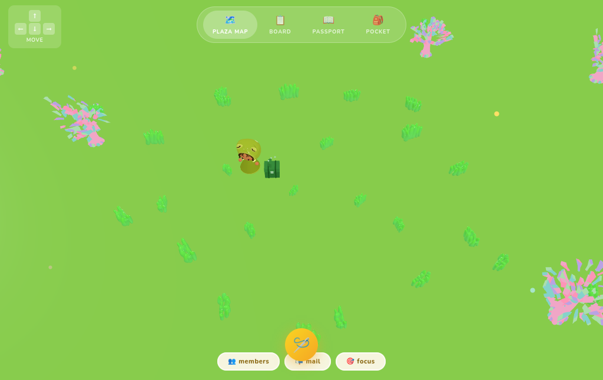

# Hearth 
**Gamified Project Management Web App**

Hearth is a full-stack MERN application that replaces traditional checkboxes with a hand-crafted 3D environment. Built for those who find standard productivity tools clinical, Hearth turns "to-dos" into a digital garden where every completed task contributes to a persistent, evolving world.

---

## Live Demo
**Sign Up Screen**

**Companion Selection Screen**

<h3 align="center"> Feature Gallery</h3>

<table align="center">
  <tr>
    <td align="center"> <b>3D Plaza Overview</b></td>
    <td align="center"> <b>Add a task</b></td>
  </tr>
  <tr>
       <td align="center">  Dynamic Updates</td>
    <td align="center"> <b>Party Invite </b></td>
  </tr>
</table>

  
<b>View More System Screenshots </b>

   
  <table align="center">
    <tr>
          <td align="center"> <b>Manage the Quest</b></td>
      <td align="center"> Task in Progress </td>
    </tr>
    <tr>
      <td align="center"> Completed Task </td>
      <td></td>
    </tr>
  </table>

---

## Technical Stack

- **Frontend:** React.js, Three.js (3D Rendering)
- **Backend:** Node.js, Express.js
- **Database:** MongoDB (Mongoose ODM)
- **Authentication:** JWT (Stateful session management)
- **Creative Suite:** Blender & Nomad (3D Assets), Procreate (2D UI/UX)

---

## How It Works

Hearth bridges a high-performance 3D engine with a traditional MERN stack, turning standard database operations into a tangible, interactive experience.

### The 3D Engine & Input
* **Keyboard State Tracking:** Utilizes custom event listeners for **WASD/Arrow keys** to bypass default browser latency, allowing for fluid, "zero-lag" character movement.
* **Proximity Logic:** The application calculates the player's mathematical distance to 3D task nodes in real-time to determine which quest is currently being "visited" or interacted with.
* **Asset Optimization:** Custom **Blender** models are exported as `.glb` files.

---

### The Gamified Backend
* **Dynamic Reward Scaling:** Upon task completion, the Node/Express backend calculates XP rewards based on priority and difficulty metadata, triggering a "Gold XP" animation on the frontend.
* **Cloud Persistence:** All user states, character choices, and party memberships are synced via **MongoDB Atlas**, ensuring progress is saved and synchronized across all sessions.
* **Secure Collaboration:** Plazas and quest data are protected by **JWT authentication**, ensuring that party interactions and private data remain secure.

---

## Key Features

- **Explorable 3D Plaza:** A fully interactive isometric world where tasks are represented as physical, interactive nodes.
- **Social Party System:** Invite friends to your plaza to share quest lists and track group productivity in a shared space.
- **Persistent Progression:** Real-time streak tracking and experience points (XP) that evolve your digital garden over time.
- **Character Customization:** Choose from unique, Blender-rendered companions that represent your player profile.
- **Security-First Design:** Full JWT-based protected routes and hashed password storage (Bcrypt) for all user data.
  
---

## Technical Highlights

- **The Game Loop:** Implemented a `requestAnimationFrame` loop in React to handle smooth 60fps character movement and collision detection.
- **State Management:** Utilized React Hooks and Refs to decouple heavy 3D rendering from the UI, solving potential performance bottlenecks.
- **Asset Optimization:** Low-poly Blender models exported as `.glb` for fast web delivery.

---

## The "Why"
Hearth was born from a desire to bridge the gap between "work" and "play." Inspired by the rewarding feedback loops in games like *Stardew Valley*, I built this to prove that productivity doesn't have to be stressful but instead, a restorative, creative experience.

---

### Connect with Me
**Abigail Endris** [LinkedIn](https://www.linkedin.com/in/abigail-endris/) · [Email](mailto:endrisabigail@gmail.com)
